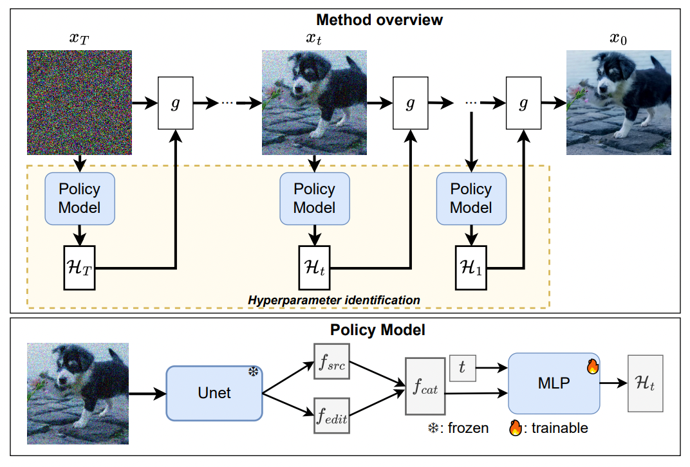
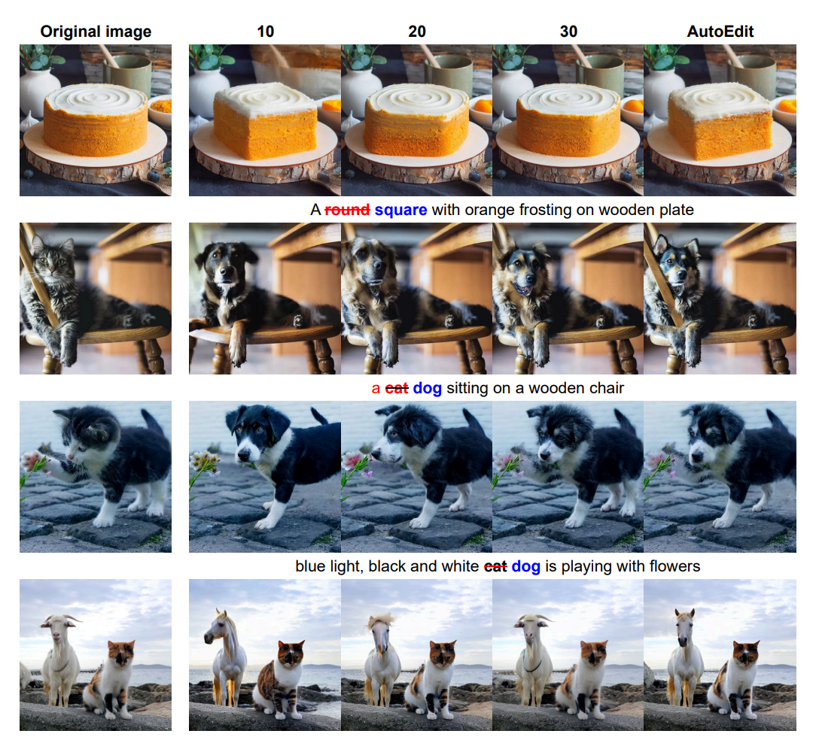

# [NeurIPS 25] Official implementation of AutoEdit: Automatic Hyperparameter Tuning for Image Editing

This is the official implementation of AutoEdit: Automatic Hyperparameter Tuning for Image Editing (NeurIPS 2025). The paper can be found [here](https://arxiv.org/abs/2509.15031):





### To-do list

- [x] Release inference code.
- [x] Release training code.

## Installation

For editing methods running with SD 1.4, please refer to the environment installation in ``python_env/environment.yml``:

```bash
conda env export -n p2p > python_env/environment.yml
```

or you can install the environment by pip on your own. Note the version of some important libraries:

```
accelerate==1.4.0
diffusers==0.12.0
torch==2.1.2
transformers==4.37.2
```

Note that the version of diffusers is low with the SD 1.4 model, I will try to update the code to make it compatible with recent diffusers version.

Stay tuned for SDXL and DiT model.

## Checkpoint

Checkpoint path can be downloaded [here](https://drive.google.com/drive/folders/1uA2EZ2RogMFQFzzIVf2MPusmTKAAwaF0?usp=sharing). Each folder will be the checkpoint of AutoEdit with the corresponding method (see the Running AutoEdit section).

## Running AutoEdit

You can run AutoEdit by following these scripts:

**DDPM-Inversion**: Search for inversion timestep:

```bash
python run_training_wo_attention.py \
    --checkpoint "exp/ddpm_ppo/checkpoint.ckpt" \
    --input_image_path "assets/cake.jpg" \
    --src_prompt "a round cake with orange frosting on a wooden plate" \
    --tgt_prompt "a square cake with orange frosting on a wooden plate" \
    --save_edit_path "output/edit_cake.png"
```

**P2P**: Conduct the DDPM Inversion and cross-attention ratio search:

```bash
python run_training.py \
  --checkpoint "exp/ddpm_ppo/checkpoint.ckpt" \
  --input_image_path "assets/cake.jpg" \
  --src_prompt "a round cake with orange frosting on a wooden plate" \
  --tgt_prompt "a square cake with orange frosting on a wooden plate" \
  --save_edit_path "output/edit_cake.png"
```

**Null-text**: Null-text inversion and searching for inversion timestep
```bash
python null_text_inversion.py \
  --checkpoint_path "exp/null_text_ppo/checkpoint.ckpt" \
  --input_image_path "assets/cake.jpg" \
  --src_prompt "a round cake with orange frosting on a wooden plate" \
  --tgt_prompt "a square cake with orange frosting on a wooden plate" \
  --save_edit_path "output/edit_cake.png"
```

**Adaptive CFG**:
```bash
python run_training_cfg.py \
    --checkpoint "exp/cfg_ppo/checkpoint.ckpt" \
    --input_image_path "assets/cake.jpg" \
    --src_prompt "a round cake with orange frosting on a wooden plate" \
    --tgt_prompt "a square cake with orange frosting on a wooden plate" \
    --save_edit_path "output/edit_cake.png"
```

All scripts are available at ``scripts`` folder.

## Training AutoEdit

Prepare the dataset: You can find the dataset [here](https://drive.google.com/file/d/1vI95rLwleXZs_2lUxulI-f06Ngr8XcL1/view?usp=sharing). Put it into the ``data`` folder.

Training AutoEdit for DDPM inversion:

**Stage 1**:SFT training
```bash
python run_training_wo_attention.py \
    --exp_name "exp/ddpm_ppo_sft" \
    --num_epochs 5 \
    --low 0.05 \
    --range 0.6 \
    --annotation_folder "data/EditBench/EditData" \
    --train_sft
```

**Stage 2**: PPO training
```bash
python run_training_wo_attention.py \
    --exp_name "exp/ddpm_ppo_sft" \
    --num_epochs 15 \
    --annotation_folder "data/EditBench/EditData" \
    --train_ppo \
    --checkpoint "path/to/checkpoint_sft"
```

## Citation

If you find our work interesting, please considering cite:

```
@article{pham2025autoedit,
  title={AutoEdit: Automatic Hyperparameter Tuning for Image Editing},
  author={Pham, Chau and Dao, Quan and Bhosale, Mahesh and Tian, Yunjie and Metaxas, Dimitris and Doermann, David},
  journal={arXiv preprint arXiv:2509.15031},
  year={2025}
}
```